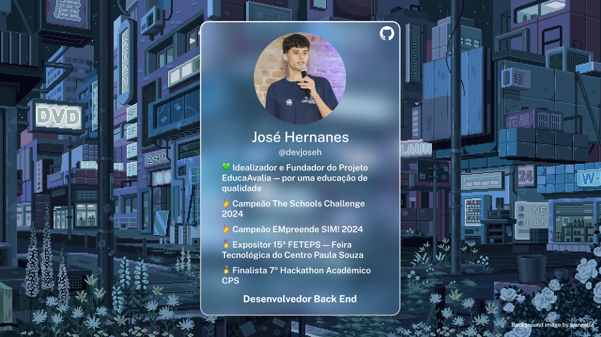

 

&nbsp;
&nbsp;

 

Fundador e Desenvolvedor do projeto EducaAvalia - Um aplicativo de avaliações de escolas inclusivas e acessíveis para alunos com deficiência.

Programador entusiasta com habilidades em Typescript, NodeJS, Lua, Firebase, Mongodb e nas horas vagas, Designer. Sou apaixonado em resolver desafios e estou sempre pronto para aprender e colaborar.

## 🔨 Linguagens e Ferramentas

👨‍🏫 “𝘚𝘦 𝘢 𝘦𝘥𝘶𝘤𝘢𝘤𝘢𝘰 𝘴𝘰𝘻𝘪𝘯𝘩𝘢 𝘯𝘢𝘰 𝘵𝘳𝘢𝘯𝘴𝘧𝘰𝘳𝘮𝘢 𝘢 𝘴𝘰𝘤𝘪𝘦𝘥𝘢𝘥𝘦, 𝘴𝘦𝘮 𝘦𝘭𝘢 𝘵𝘢𝘮𝘱𝘰𝘶𝘤𝘰 𝘢 𝘴𝘰𝘤𝘪𝘦𝘥𝘢𝘥𝘦 𝘮𝘶𝘥𝘢.” - 𝘗𝘢𝘶𝘭𝘰 𝘍𝘳𝘦𝘪𝘳𝘦

